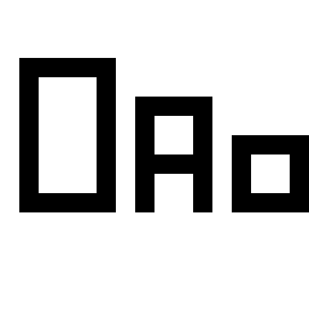
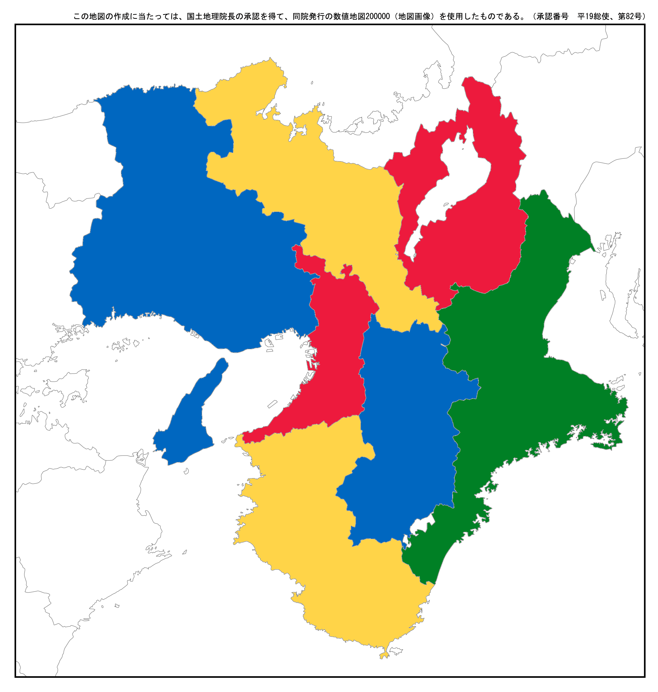

プログラミング言語俯瞰
======================
於 2012/09/15 関西情報系団体交流会

京都産業大学電子計算機応用部 【本名部分削除】

前置き
-----

### お前誰や
* name =  【本名部分削除】 a.k.a. tasuten
* attr = [ 京都産業大学, 同コンピュータ理工学部(B2), 同電子計算機応用部 ]
* 部内ではサーバ管理者という名前のWebサイト更新係
* 好きな言語・よく使う言語はRuby、C言語、VimScrpit？
    * 最近はSchemeとかPrologとかJSとかJavaとかにも手を伸ばしてる
* <https://twitter.com/tasuten>
* <http://about.me/tasuten>

### どーん


### タイムテーブル
* (前半45分) プレゼン
    * プログラミング言語の世界をざっと眺めてみる感じで
* (後半45分) プログラミング
    * 各位プログラミング言語を1つ選んで頂きその言語の入門

### 本題に入る前に免責事項
* このプレゼンにおいて、私が述べることは必ずしも正しいことであるとは保証できません。私の勘違いや主観とかごちゃごちゃに混じってるかもしれません。ので、詳細に関しましては書籍などの情報に頼ることをおすすめします。
* 聞きかじりの知識が結構な割合で混ざってたりするかもしれないので情報の利用は各自の責任でお願い致します。
* ほとんど全てのページにおいてWikipediaを参考にしたというクォリティなので色々お察し下さい
    * せめて皆様の理解の助けに微力でもなれば幸いで御座います
* あと、コードのシンタックスハイライトが変でもスルーをお願いします

本題
----

### プログラミング言語って？ (1)
<article class='smaller' style='font-style: italic'>
<q>プログラミング言語（プログラミングげんご）とは、コンピュータに対する一連の動作の指示を記述するための人工言語の総称である。</q>
<span style='font-size: smaller'>
プログラミング言語 - Wikipedia <http://ja.wikipedia.org/wiki/プログラミング言語>
<span>
</article>

### プログラミング言語って？(2)
<article class='smaller' style='font-style: italic'>
<q>プログラミング言語とは、コンピュータにおけるソフトウエアを開発することを主目的に作られた人工言語である。つまり、ソフトを作るときに書いたりする、映画とかで研修室の画面に流れてたりする、ムズカシソーなアレ。</q>
<span style='font-size: smaller'>
プログラミング言語とは (プログラミングゲンゴとは) - ニコニコ大百科 <http://dic.nicovideo.jp/id/194930>
</span>
</article>

### プログラミング言語って？ (3)
* 要は所謂プログラミングするときにifとかwhileとか書く時のアレ
* コンピュータ言語<sup>1</sup>の内、**チューリング完全**である言語を「プログラミング言語」と呼ぶことが多い
* ので、ここでも「プログラミング言語」は「チューリング完全であるコンピュータ言語」を指すこととする

<span style='font-size: medium;line-height: 120%; position: absolute;bottom: 30px; left: 20px;'>
1: コンピュータ関連技術において使われる人工言語。プログラミング言語以外にも、問い合わせ言語(SQL等)、マークアップ言語(HTML、XML等)、正規表現、設定ファイルの書式言語、モデリング言語(UML等)等も含む
</span>

### じゃあそのチューリング完全ってなんぞ (1)
* 万能チューリングマシンと同じ能力を持つこと
* 詳細は専門書等に譲るとして、恐ろしく大雑把に言うと
    * その言語が万能チューリングマシンをシミュレート可能な場合、その言語はチューリング完全
    * 「チューリング完全」な言語では、 _実効可能なアルゴリズムや手続き<sup>1</sup>は、「理論的には」いかなる言語で有ろうとも実行可能_（現実的に可能かは置いといて）
    * つまり、チューリング完全な言語では、_パフォーマンスや生産性等を無視すると、その言語で実現可能なことはどれも同じ_
<span style='font-size: medium;line-height: 120%; position: absolute;bottom: 30px; left: 20px;'>
1: 計算機科学においては、停止性が証明された解法手順をアルゴリズム、停止性が証明されていないようなものも含む解法手順を手続きと区別することがある
</span>

### じゃあそのチューリング完全ってなんぞ (2)
* それは言語の規模の大きさに寄らず、例えば
    * 仕様が巨大と言われる言語（C++やJava等）であろうが、
    * 組み込み関数が3つしかない言語であろうが([Lazy K](http://ja.wikipedia.org/wiki/Lazy_K "Lazy K"))
    * 5つの基本関数しか持たない言語（[純LISP](http://ja.wikipedia.org/wiki/%E7%B4%94LISP "純LISP")）であろうが、
    * 8個の命令しか持たない、最小の処理系のサイズがたった98バイトの言語（[Brainf*ck](http://ja.wikipedia.org/wiki/Brainfuck "Brainfuck - Wikipedia")）であろうが、
* 理論上は（パフォーマンスや生産性を無視すると）同じだけの能力を持つ、ということ
* （上に上げた言語は全てチューリング完全）

### じゃあそのチューリング完全なコンピュータ言語のプログラミング言語ってどれくらいあるの？
* <http://ja.wikipedia.org/wiki/プログラミング言語一覧>には8/25時点で267個
* <http://en.wikipedia.org/wiki/List_of_programming_languages>には8/25時点で656個
* さらに細かいものまで入れると恐らく数千？
    * 多分把握不能
* しかも年々増え続けてる
    * そしてプログラミング言語の世界にも盛者必衰、諸行無常の理はある。消えたり生まれり忘れ去られたりしぶとく生き残ってたり

### プログラミング言語の系統樹
* Computer Languages History <http://www.levenez.com/lang/>
* diagram & history of programming languages <http://rigaux.org/language-study/diagram.html>

### 本題の本題
* 今回はその沢山あるプログラミング言語のうち
    * 有名である・広く使われているもの
    * 有名ではないが興味深いコンセプトを持つと思ったもの
    * 他、気になったもの
* を主観で選んだ
* このプレゼンではこれからそれらの言語を順に紹介していく、つまりプログラミング言語の世界を俯瞰してみる
* 補記
    * 主な処理系では特にフリーなものを中心に上げた
    * この後出てくるコードの実行環境は以下の通り

``` sh
$ sw_vers
ProductName:    Mac OS X
ProductVersion: 10.8.1
BuildVersion:   12B19
```

プログラミング言語俯瞰
----------------------

### アセンブリ言語
* コンピュータが唯一理解可能な言語である機械語を、人間に分かりやすい形でも読み書き出来るようにした、低水準言語
* 基本的には機械語の命令と一対一でアセンブリ言語の命令を対応させ、その命令を用いて書く
* とてもハードウェア寄りの言語なので、プロセッサ等ハードウェアの性能をギリギリまで活かしたい場合等に現在でも用いられている
* ちなみに、gccは-Sでアセンブリコードを出力可能
* 主な処理系
    * masm
    * nasm
    * GAS(GNU Assembler)

### アセンブリ言語で書かれたコードの例（GASの場合）

<article class='smaller'>

``` asm
/* 複数行コメント(GNU Assembler)
 * sample.s
 * システムコールのexitを10で呼び出すだけ
*/
.text
.globl _main
_main:
# 単行コメント
# exitのシステムコール番号は、Macでは1
movq $1, %rax
# 終了コードとして10を返してみる
movq $10, %rdi
# exitシステムコールを呼び出す
syscall
```
``` sh
$ as -v
Apple Inc version cctools-829, GNU assembler version 1.38
$ as -o sample.o sample.s
$ gcc -o sample sample.o
$ ./sample
$ echo $?
10
```
参考: Mac OSX Mountain Lion で 64bit(x86-64) アセンブリ言語の HelloWorld プログラム #MacOSX #x86-64 - Qiita <http://qiita.com/items/b7ed1c9feef1b570a6b9>
</article>

### FORTRAN
* 歴史上初の高水準言語。1954年IBMのジョン・バッカス氏によって考案された。
    * [バッカス・ナウア記法](http://ja.wikipedia.org/wiki/%E3%83%90%E3%83%83%E3%82%AB%E3%82%B9%E3%83%BB%E3%83%8A%E3%82%A6%E3%82%A2%E8%A8%98%E6%B3%95 "バッカス・ナウア記法")のバッカス氏
* 科学技術計算に強い言語であり、スーパーコンピュータ上などではまだまだ現役
    * 例えば「[京](http://news.mynavi.jp/articles/2011/09/05/kei_supercomputer/003.html "京")」や「[TSUBAME](http://tsubame.gsic.titech.ac.jp/docs/guides/tsubame2/html/programming.html "TSUBAME")」、「[地球シミュレータ](http://www.jamstec.go.jp/es/jp/es1/system/languages.html "地球シミュレータ")」でもFORTRANは利用可能
* 最新の規格はFortran 2008
* 主な処理系
    * GFortran、G95等
* 次のページのコードのコンパイル・実行は以下のように

``` sh
$ gfortran fib.f90
$ ./a.out
```

### FORTRANで書かれたコードの例（Fortran90の場合）

<article class='smaller'>

``` f90
program fibo_arr
!  !から行末まではコメントとして扱われる。
!  FOTRANには「固定形式」と「自由形式」という2つの書き方があるらしく、
!  このプログラムは自由形式の方で書いている
!  詳しくは「fortran 自由形式 固定形式」などでググると出てくる

!  「暗黙の型宣言」を行わない。
!  FOTRANではデフォルトでは型宣言を行わない場合
!  [a-ho-z]で始まる変数は実数型、[i-n]で始まる変数は整数型として扱われる
      implicit none
! 整数型のループ変数i
      integer i
! 要素数20の配列の宣言
! 配列の[]はFOTRANでは()となる。又、添字は1から始まる
      integer f(20)
! fib[1]、fib[2]の設定
      f(1) = 1
      f(2) = 1

! 第三項以降を計算して配列の各要素に格納
      do i=3,20
        f(i) = f(i-1) + f(i-2)
      end do
! 配列の中身を表示
      do i=1,20
        print *, f(i)
      end do
end program fibo_arr
! 参考: Fortran入門 <http://www.nag-j.co.jp/fortran/index.html>
```

</article>


### COBOL
* 1959年誕生。最古参のプログラミング言語の1つ。誕生にはアメリカ国防総省が絡んでいる
* 金銭計算や事務処理等の商用計算に強い言語
* また、文法が自然言語に近いことも特徴の1つ
    * そのためからか、「冗長だ」と言われることもしばしば
    * 実際書いてみようと思ったが見出し部が必須だったり行番号云々だったりと…
* 誕生から半世紀近く経つ今でも今なお多数の企業や組織で使われている
    * 一説によると今なお2000億行以上のCOBOLのコードが稼働しているとか
* 主な処理系: OpenCOBOL等


### ALGOL
* 1958年にALGOL58が誕生。ALGOL60やALGOL68もある。
* ALGOL自体は普及はしなかったものの、ALGOLの文法はその後のプログラミング言語の文法に大きな影響を与えた
    * 例えばブロック構造や再帰呼び出し、引数の値渡し等はALGOLがもたらした影響の1つ
    * ALGOLの影響を受けた言語群を「ALGOL系言語」のように呼ぶこともあり、例えば以下の言語が挙げられる
        * Pascal、Ada、PL/I、…
        * C言語、C++、Objective-C、Java、C#、…
        * Perl、Python、Rubyのようなスクリプト言語等々
* 主な処理系
    * [Algol 68 Genie](http://jmvdveer.home.xs4all.nl/algol.html "Algol 68 Genie")
* 参考
    * <http://ja.wikipedia.org/wiki/ALGO>, <http://www.wdic.org/w/TECH/ALGOL>

### Pascal及びその後継言語 (1)
#### Pascal
* ALGOLの流れを組む教育用言語
* 1970年にスイスのチューリッヒ工科大学ニクラウス・ヴィルト氏が開発
* Pascalを拡張したDelphi<sup>1</sup>という言語及び統合開発環境が特に有名
    * ちょっと昔のWindows用ソフトの中身が実はDelphi製だったりすることがあったり無かったり
        * TeraPad、Sleipnir、なでしこ、Jane系2ちゃんねるブラウザ、RPGツクール、窓の手、等々？[■](http://q.hatena.ne.jp/1129720743 "■")

<span style='font-size: medium;line-height: 120%; position: absolute;bottom: 30px; left: 20px;'>
1: Borland...
</span>


### Pascal及びその後継言語 (2)
#### Ada
* アメリカ国防総省によって開発された。主に軍用・航空機産業に使われる。
* 世界初のプログラマ（かつ世界初の女性プログラマ）と言われるエイダ・ラブレス夫人の名にちなむ<sup>1</sup>
* ボーイング777ジェット機やF-22戦闘機などの制御ソフトウェアはAdaで書かれてるとか [■](http://ja.wikipedia.org/wiki/Ada "■")

#### Eiffel
#### VHDL

<span style='font-size: medium;line-height: 120%; position: absolute;bottom: 30px; left: 20px;'>
1: ちなみにそのコードはベルヌーイ数を求めるためのものだったとか         [エイダ・ラブレス - Wikipedia](http://ja.wikipedia.org/wiki/%E3%82%A8%E3%82%A4%E3%83%80%E3%83%BB%E3%83%A9%E3%83%96%E3%83%AC%E3%82%B9 "エイダ・ラブレス - Wikipedia")
</span>

### BASIC (1)
* 1964年、ダートマス大学のケメニー氏とカーツ氏によって、教育用言語として開発された
* 名前の通り文法は比較的簡素で初心者向けとされる
    * 初心者向けということで算術演算子以外極力記号を使わないようにしている
* その簡素な文法から広く使われていた
    * NECのPC-8800/9800(N88-BASIC)
    * センター試験の数学II・Bの選択問題の内、プログラミングの問題はN88-BASIC風のBASICが使われている
    * Visual Basic(Microsoft)
        * MS Office(Visual Basic for Application(VBA)
        * Visual Basic.NET
        * Windows Script Host, Internet Explorer(VBScript)
    * ファミコン上([ファミリーベーシック - Wikipedia](http://ja.wikipedia.org/wiki/%E3%83%95%E3%82%A1%E3%83%9F%E3%83%AA%E3%83%BC%E3%83%99%E3%83%BC%E3%82%B7%E3%83%83%E3%82%AF "ファミリーベーシック - Wikipedia"))
    * [ニンテンドーDSi上でプログラム言語「BASIC(ベーシック)」が使える「プチコン」 - GIGAZINE](http://gigazine.net/news/20110224_petitcom/ "ニンテンドーDSi上でプログラム言語「BASIC(ベーシック)」が使える「プチコン」 - GIGAZINE")


### BASIC (2)
* その他にも様々な処理系が存在する
* また、BASICをさらに簡略化したものとしてTiny BASICと呼ばれるものがあり、その処理系の実装は比較的簡単
    * そのため、TinyBASIC処理系を他の言語を用いて数百行程度のコードで実装した例が結構ある模様

----------------------------------------------------------

* これは私見だけどBASICってPascalとやや似た立ち位置にあるのかも
    * 教育用言語
    * VB.NET - Delphi
    * 方言・後継言語が多い
    * その言語や後継言語が、やや特殊な環境でも用いられている
    * 昔は流行ったが今はあまり見かけない


### BASICで書かれたコードの例（cbmbasic(Commodore BASIC)の場合）

``` basic
10 INPUT "COUNT UP TO "; MAX
15 REM IT IS A COMMENT
20 SUM = 0
30 FOR I = 1 TO MAX
40     SUM = SUM + I
50     PRINT I; SUM
60 NEXT
70 END
```

``` sh
$ cbmbasic countup.bas
COUNT UP TO ?10

 1 1
 2 3
 3 6
 4 10
 5 15
 6 21
 7 28
 8 36
 9 45
 10 55
```


### C (1)
* 1972年、主にAT&Tベル研究所のデニス・リッチー氏によって開発された
    * 開発目的はUNIXの移植性を高めるため
        * 故に低水準な記述も高水準な記述も両方出来る
* 恐らく世界で最も広く使われているプログラミング言語
    * OS
    * Webブラウザ
    * エディタ
    * コンパイラ、インタプリタ
    * デバイスドライバ
    * 組み込み機器の制御プログラム
    * その他諸々の多くがC/C++で書かれていると考えてもいい
* 一番最初に学ぶプログラミング言語としても採用されることが多い


### C (2)
* 自由度、実行速度、コンパイル速度は非常に特化してる
* 最新の規格は2011年改定のC11
* 名前の「C」の由来はCの前身となった言語が「B」だったから
    * ちなみに「B」の由来はBの開発者のケン・トンプソンの妻Bonnieの名とも、
      Bの更に前身のBCPLとも[■](http://wired.jp/2012/08/08/arcana-of-computing/4/ "■")
* 元々OS開発用に作られた言語なので、先にも述べた通りハードウェア寄りの記述が可能
    * その例で、Cに特徴的な機能としてポインタがある
* ちなみにCのブロックコメントの/* */はPL/Iというプログラミング言語がルーツだとか<sup>1</sup>
<div style='font-size: medium;line-height: 120%; position: absolute;bottom: 30px; left: 20px;'>
1: 『JavaScript: The Good Parts ―「良いパーツ」によるベストプラクティス』/Douglas Crockford著, 水野貴明訳 第二章2.1, 及びhttp://www.bohyoh.com/CandCPP/FAQ/FAQ00043.html より<br />
ちなみに同URLによるとC99で正式採用された//による一行コメントはBCPL由来らしい。通称BCPL形式。また先行してC++ではこの//形式のコメントが採用されていた
</div>

### C (3)
* デニス・リッチー氏とブライアン・カーニハン氏によって書かれた『プログラミング言語C』(The C Programming Language)は、CがANSIやISOによって規格化されるまで実質的なリファレンスとして扱われCのバイブル的な書籍
    * 通称K&Rとも呼ばれる
* Cの影響を受けた言語としては
    * C++、 Objective-C、C#、D、Go、Java等が挙げられる
* 主な処理系
    * GCC（GNU Compiler Collection）
    * clang
    * Microsoft Visual C++

### Cで書かれたコードの例（GCCの場合）
<article class='smaller'>

``` c
/*
 * 複数行コメント
 */
#include <stdio.h>
#define LENGTH 10

void bubbleSort(int *data, int size);
void swap(int *a, int *b);

int main(int argc, char *argv[])
{
  int data[LENGTH] = {2, 3, 4, 1, 5, -20, 100, 200000, 1999, 0};
  int i;

  bubbleSort(data, LENGTH);

  /* 結果表示 */
  for (i = 0; i < LENGTH; i++) {
    printf("%d¥n", data[i]);
  }

  return 0;
}

void bubbleSort(int *data, int size) {
  int i, j;
  for (i = 0; i < size; i++) {
    for (j = 1; j < size - i; j++) {
      if (data[j-1] > data[j]) {
       swap(&data[j-1], &data[j]);
      }
    }
  }
}

void swap(int *a, int *b) {
  int tmp;
  tmp = *a;
  *a = *b;
  *b = tmp;
}

```
</article>


### C++ (1)
* 1983年ベル研究所の科学者であったビャーネ・ストラウストラップ氏<sup>1</sup>によってCを拡張した言語として開発された。
    * Cに
        * オブジェクト指向・多重継承
        * オーバーロード（多重定義）
        * テンプレート
        * 例外処理
    * などが追加されている
    * そのため、手続き型、オブジェクト指向、ジェネリックなどの様々なプログラミングパラダイムをサポート
* その機能は膨大であり、さらに機能の追加は今なお進んでる
* 最新の規格はC++11
<span style='font-size: medium;line-height: 120%; position: absolute;bottom: 30px; left: 20px;'>
1: すごくどうでもいいことかもしれないけど、ストラウス-トラップと区切って読むと読みやすい
</span>

### C++ (2)
<article class='smaller'>

#### オーバーロード（多重定義）
例えば'+'という演算子に対する多重定義を考える。同じ型の変数a, bについて、「a + b」を、a, bが整数型であって整数型に対する'+'が整数の足し算として定義されている場合「a + b」はaとbの和を表し、同様にa, bが複素数であれば複素数の和を表し、同様にa, bが文字列型で有ればaとbを結合した文字列を表す、と言ったようなプログラムの文脈に応じて動作を選択することで複数の動作を行わせる仕組み。

#### テンプレート
 例えば関数maxがテンプレートを用いて以下の様に定義されているとする。

``` c++
template <typename T>
T max(T x, T y) {
    if (x < y) {
        return y;
    }else{
        return x;
    }
}
```

ここで、ある型typeに対して'<'演算子が適切に定義されているとする。また、x, y共にtype型で有るとすると、その型に対してこのmax関数は意図している通りに動く。
</article>

### C++ (3)
* 名前の由来は「C」と「インクリメント演算子」(++)
    * Cをより進ませたものと言ったニュアンス？
* ほぼCの上位互換である
    * なのでCで書かれたコードは大抵の場合C++としてもコンパイル可能
    * ただ、例えばC++独自の予約語をそのCのコードで変数名などに使っていると困ったことになる
    * 他には、Cではvoid *は暗黙に型変換されるがC++では変換を明示する必要がある
    * ちなみにこのように従来のCのような使い方、つまり手続き型プログラミングな使い方をする時、C++をbetter Cと比喩することがある
* 主な処理系
    * g++
    * Visual C++
    * Clang

参考: C++ - Wikipedia <http://ja.wikipedia.org/wiki/C%2B%2B>、及び各当該項目

<h3>Objective-C, C#</h3>

#### Objective-C
* CにSmalltalkをミックスした言語
* 名前の通りオブジェクト指向
* Mac OS X、iOSのアプリケーションを書く際の標準的な言語
* MacやiPhone、iPadの普及に伴い注目度がグンと上がった

<h4>C#</h4>

* MicrosoftがC++等をベースに.NET環境向けに作った
* .NETにおいては最も標準的な言語
* 名前の由来は(C++)++とC#の開発の中心のアンダース・ヘルスバーグ氏は語る


### Java (1)
* 1990年代前半、サン・マイクロシステムズ<sup>1</sup>のジェームズ・ゴスリング氏やビル・ジョイ氏らによって開発されたオブジェクト指向プログラミング言語
* Javaのコードはコンパイラによって、Java仮想マシン（JVM）という仮想実行環境上で動作するJavaバイトコードとして出力される
    * そのため、JVMが動く環境で有ればどのような環境でもそのバイトコードは動く、とされている
        * 実際には完璧にという訳ではなくまだ問題は残っている
* Javaは様々な範囲に応用されている
    * 例えばWebブラウザ上（Javaアプレット）、Webサーバ上(Javaサーブレット等)、デスクトップアプリケーション、携帯機器・組込みシステム(Java ME)、Androidアプリ等

<span style='font-size: medium;line-height: 120%; position: absolute;bottom: 30px; left: 20px;'>
1: 2010年、オラクルによって買収された
</span>

### Java (2)
* プログラミング言語としての特徴としては以下のものが挙げられる
    * オブジェクト指向（ただしC++とは違い多重継承は不可）
        * 多重継承が無い代わりに、Javaは「インターフェイス」という機能を提供している
    * 強い静的型付け
    * 例外処理
    * ガベージコレクション
        * 参照されなくなったメモリ領域を把握して適時自動で開放する
    * マルチスレッドプログラミング
        * Javaではマルチスレッドによる並行処理を比較的容易に書くことが出来る

### Java(3), 関連する言語
* Javaを電子アートやビジュアルデザイン向けに簡素化した言語としてProcessingがある
* Javaで実装されJVM上で動く言語もある
    * Scala … オブジェクト指向と関数型のマルチパラダイム言語
    * Clojure … LISP方言の1つ
    * Groovy … アジャイルな動的言語
* 他、既存の言語の処理系をJavaで実装しJVM上で動くようにした処理系もある
    * JRuby (Ruby), Jython (Python), Rhino (JavaScript)
* 一般に、これらの言語/言語処理系からは既存のJavaのライブラリが使えることが多い

```
; Clojureでの例
(println "java.vm.version is"
        (. System getProperty "java.vm.version")
)
; -> java.vm.version is 20.10-b01-428
```

### Perl
* 1987年にラリー・ウォール氏によって最初のバージョンがリリースされたスクリプト言語
* C、sed、AWK、シェルスクリプト等の影響を受けており、テキスト処理に強い
* Webアプリケーション開発にも使われる
* 文法は比較的簡素
* オブジェクト指向プログラミングも可能
* スローガンは「There's More Than One Way To Do It.」（TMTOWTDI, やり方は一つじゃない）
* 最新バージョンは5.16.0
* CPANというPerlのライブラリ・モジュール等を集めた巨大なライブラリサイトがある

### Python
* 1990年、グイド・ヴァンロッサム氏によって開発されたオブジェクト指向スクリプト言語
* 特に海外では広く使われている。Googleも広く採用している
* 「Python」の由来は『空飛ぶモンティ・パイソン』より
* 特徴的な文法としてはインデントにブロック構造の記述がある
* スローガンは「There's Only One Way To Do It」（TOOWTDI, やり方はただ一つ）
* つまり、Pyhonではあることを実現する方法は1つのみであったほうが良い、という考え方がある
* 現在2.x系統と3.x系統が両立している
* Perlで言うCPANのようなものとして、PyPIというものがある
* パッケージ管理システムとしてeasy_installやpipがある

### Ruby
<article class='smaller'>

* 現在は島根県松江市在住のまつもとゆきひろ(Matz)氏によって1993年から開発されたオブジェクト指向スクリプト言語
* 特に日本では広く広まっている
* スローガンは「多様性は善」。また、まつもと氏は、楽しくプログラミングができる言語であることを最重視している
* Rubyではデータ型もオブジェクトであり、純粋なオブジェクト指向言語であると言える
* 特徴的な機能としては
    * ブロック付きメソッド呼び出し
        * メソッドをコードのブロックと一緒に呼び出す
    * クロージャ
    * Mix-in
        * モジュール<sup>1</sup>というものをincludeする。限定的な多重継承と考えると良い
    * オープンクラス
        * Rubyでは標準のクラスもオープンクラスになっており、プログラマが自由に書き換え可能である。
    * ダックタイピング
* 最新バージョンは1.9.3-p194。前世代の1.8.x系統も今も使われている
* パッケージ管理システムとしてRubyGemsがある
</article>

<span style='font-size: medium;line-height: 120%; position: absolute;bottom: 30px; left: 20px;'>
1: インスタンスを持たないクラスのようなもの
</span>

### PHP
* 1995年、ラスマス・ラードフ氏によって開発されたサーバサイドスクリプト言語
* 動的なウェブページ製作に特化している
* 文法は比較的平易。また、オブジェクト指向プログラミングをサポートしている
* PHPで書かれた主要なソフトウェアとしてはMediaWiki、PukiWiki、WordPressなどがある
* 最新版は5.4.6
* Perlで言うCPANのようなものとしてPEARと言うものがある


### JavaScript<sup>1</sup>
<article class='smaller'>

* 1990年代前半、ネットスケープコミュニケーションズ<sup>2</sup>のブレンダン・アイク氏によって開発されたオブジェクト指向スクリプト言語
* 主にWebブラウザ上で動く
* プログラミング言語としては以下の様な特徴がある
    * プロトタイプベースのオブジェクト指向
        * 各オブジェクトは既存のオブジェクトのクローンから作成される
    * 第一級関数をサポート
        * つまり、無名の関数が作れたり、変数に格納可能であったりする
    * 各ブラウザ間で微妙な実装の差異がある
* DOMと呼ばれる、HTML/XMLにアクセスするAPIがある
* セキュリティ上の問題から、基本的にローカルファイルへのアクセスは想定されていない

* 関連言語
* JavaScriptはECMAScriptとして標準化されており、また、ECMAScriptを拡張した言語としてAdobeのActionScriptがある
* CoffeeScriptと言う、JavaScriptの生産性を上げることを目的に作られた言語がある。RubyやPython、Haskellなどの影響も受けている。CoffeeScriptで書かれたコードは処理系によってJavaScriptのコードに変換し利用される
* JavaScriptのデータ表記法をベースにしたデータ記述言語としてJSONというものがある
</article>
<div style='font-size: medium;line-height: 120%; position: absolute;bottom: 30px; left: 20px;'>
1: ちなみにJavaとはあまり関係がない <br />
2: 現在はMozilla Foundation, Mozilla Corporationに移行
</div>

### LISP (1)
<article class='smaller'>

* 1958年、ジョン・マッカーシー氏によって開発された、FORTRANに次いで2番めに古いプログラミング言語
* 誕生から半世紀以上経っているが、今なお現役の言語
* 特に人工知能分野で人気だが、多くのハッカーが好んでいる？
* プログラミング言語としては以下の様な特徴がある
    * S式による表記法
        * 括弧を多用することで有名
    * 前置記法（ポーランド記法）
        * + 1 1のように、関数や演算子を、その引数や被演算子の前に置く記法
    * 動的型付け
    * 関数型言語
        * 数学で言う関数の意味。例えばある入力に対してその出力が一意に決まるようなもの
    * コード自身を第一級オブジェクトとして扱う
        * つまり、コード自身を他の言語で言うデータのように扱える（？）
    * リストを中心に考えられている
</article>

### LISP (2)
<article class='smaller'>

* その簡素な文法故数多くの処理系・変種があり、その各変種は方言と呼ばれる
* 代表的な方言としては以下のようなものがある
    * Common Lisp … ANSIによって標準化されている。多機能主義的
    * Scheme … Common Lispに対して必要最小限な仕様を持つ
        * 処理系としてはGaucheが有名。また、Gimpの拡張記述言語Script-fuはSchemeベース
    * Clojure … JVM上で動作。並列処理に強い
    * Emacs Lisp … Emacsで用いられる拡張記述のためのLISP
    * 純LISP …最小構成のLISP。言語仕様としては5つの関数と3つの「特殊形式」のみを持つ。それでも尚チューリング完全である
* LISPに関する著名な書籍
    * 『計算機プログラムの構造と解釈』 / ハロルド・エイブルソン, ジェラルド・ジェイ・サスマン, ジュリー・サスマン
        * 通称SICP。計算機科学の古典的教科書であり、ある種の聖典
    * 『ハッカーと画家』 / ポール・グレアム
        * 彼のエッセイ集。彼はCommon Lispを用いてベンチャーで大成功を収めた人物
        * [naoya_t:ポール・グレアムのエッセイと和訳一覧](http://practical-scheme.net/wiliki/wiliki.cgi?naoya_t%3a%e3%83%9d%e3%83%bc%e3%83%ab%e3%83%bb%e3%82%b0%e3%83%ac%e3%82%a2%e3%83%a0%e3%81%ae%e3%82%a8%e3%83%83%e3%82%bb%e3%82%a4%e3%81%a8%e5%92%8c%e8%a8%b3%e4%b8%80%e8%a6%a7 "naoya_t:ポール・グレアムのエッセイと和訳一覧")も参照
* 以下、雑記
    * [魔法言語 リリカル☆Lisp](http://lyrical.bugyo.tk/ "魔法言語 リリカル☆Lisp")
    * [新・ニコ動でLisp ‐ ニコニコ動画(原宿)](http://www.nicovideo.jp/watch/sm13570088 "新・ニコ動でLisp ‐ ニコニコ動画(原宿)")
    * [hak7a3 / LISP on TeX / overview — Bitbucket](https://bitbucket.org/hak7a3/lisp-on-tex "hak7a3 / LISP on TeX / overview — Bitbucket")
    * [文月の覚え書き: sicp](http://fuzuki.blogspot.jp/search/label/sicp "文月の覚え書き: sicp")
</article>


### LISPで書かれたコードの例（Scheme(Gauche)の場合）
<article class='smaller'>

``` scheme
#!/usr/local/bin/gosh
; どうやら、「手続き」と「関数」はLISPでは同じ意味？(Schemeでは「手続き」、Common Lispでは「関数」？)
; http://blog.livedoor.jp/lisp_learner_group/archives/369091.html
(use srfi-1) ; iota手続きを使うため
; lambda式は引数列とコードを受け取りその様な手続きを生成する
(define dividable (lambda (x y) (= (modulo x y) 0)))
; condはswitch-case文のようなもの
(define fizzbuzz (lambda (x) (cond
                               ((dividable x 15) "fizzbuzz")
                               ((dividable x 5)  "buzz")
                               ((dividable x 3)  "fizz")
                               ( else            x)
                               )
                   )
  )

; (iota 100 1) → (1 2 3 .... 99 100)
; mapの部分はfizzbuzz手続きを(iota 100 1)の各要素に適用したリストを返す、と考えれば良い
; printでそのリストを出力している
(print (map fizzbuzz (iota 100 1)))

```

``` sh
$ gosh fizzbuzz.scm
(1 2 fizz 4 buzz fizz 7 8 fizz buzz 11 fizz 13 14 fizzbuzz 16 （略） fizz 97 98 fizz buzz)
```
</article>


### Haskell
<article class='smaller'>

* FPCA '87会議から形成されたHaskellの委員会によって、1990年に最初のHaskell 1.0が開発された純粋関数型プログラミング言語
    * 委員会の主要メンバーはサイモン・ペイトン・ジョーンズ氏、ポール・ヒューダック氏、フィリップ・ワドラー氏、ジョーン・ヒューズ氏等
* 先進的な機能を多く備えた言語であり、例えば以下の様なものが挙げられる
    * 高階関数
    * パターンマッチング
    * カリー化
    * リスト内包記法
    * 遅延評価
    * モナド
* 純粋関数型言語であるため、基本的には副作用のある操作（eg.)入出力、代入等）はそのままでは不可能である故、それらをモナドというものを用いて実現している
* 代表的な処理系
    * Glasgow Haskell Compiler (GHC)
</article>

### Prolog
* 1972年<sup>1</sup>、フランスのアラン・カルメラウアー氏とフィリップ・ルーセル氏らによって開発された論理型プログラミング言語
* 論理型言語の代表格。宣言型プログラミング言語でもある
    * 具体的には、手続き型言語の様にアルゴリズムを記述するのではなく、求める結果の性質・条件を記述することによってコンピュータに論理に基づき解かせる
    * 故にパズルを解く場合等に力を発揮する
* 特に人工知能分野において使われている
    * また、1982年〜1992年の日本の国家プロジェクトの開発目標であった「第五世代コンピュータ」でもその拡張言語が採用された
* 論理型プログラミング以外の特徴としてはユニフィケーション等
* 主な処理系はGNU Prolog、SWI-Prolog等

<span style='font-size: medium;line-height: 120%; position: absolute;bottom: 30px; left: 20px;'>
1: CやSmalltalkと同年
</span>

### Prologで書かれたコードの例（SWI-Prologの場合）
<article class='smaller'>

```
% 所謂地図の塗り分け問題
% 『7つの言語 7つの世界』/ Bruce A. Tateの同様の問題を4色、近畿圏に書き換えたもの

% red, yellow, blue, greenの異なる4色で塗り分ける
% . は全て「かつ」と脳内で読み替えると分かりやすい
different(red, yellow). different(red, blue). different(red, green).
different(yellow, red). different(yellow, blue). different(yellow, green).
different(blue, red). different(blue, yellow). different(blue, green).
different(green, red). different(green, yellow). different(green, blue).

% coloringを以下のように定義する
% ただ隣接関係を列挙してるだけ
coloring(Shiga, Kyoto, Osaka, Hyogo, Nara, Wakayama, Mie) :-
        different(Shiga, Kyoto), different(Shiga, Nara),
        different(Shiga, Mie),
        different(Kyoto, Shiga), different(Kyoto, Osaka),
        different(Kyoto, Hyogo), different(Kyoto, Nara),
        different(Kyoto, Mie),
        different(Osaka, Kyoto), different(Osaka, Hyogo),
        different(Osaka, Nara), different(Osaka, Wakayama),
        different(Hyogo, Kyoto), different(Hyogo, Osaka),
        different(Nara, Kyoto), different(Nara, Osaka),
        different(Nara, Wakayama), different(Nara, Mie),
        different(Wakayama, Osaka), different(Wakayama, Nara),
        different(Wakayama, Mie),
        different(Mie, Shiga), different(Mie, Kyoto),
        different(Mie, Nara), different(Mie, Wakayama).

```
</article>

### Prologで書かれたコードの例・結果
``` sh
$ swipl -f coloring.swi
% /path/to/coloring.swi compiled 0.00 sec, 15 clauses
Welcome to SWI-Prolog (Multi-threaded, 64 bits, Version 6.0.2)
Copyright (c) 1990-2011 University of Amsterdam, VU Amsterdam
SWI-Prolog comes with ABSOLUTELY NO WARRANTY. This is free software,
and you are welcome to redistribute it under certain conditions.
Please visit http://www.swi-prolog.org for details.

For help, use ?- help(Topic). or ?- apropos(Word).

?- coloring(Shiga, Kyoto, Osaka, Hyogo, Nara, Wakayama, Mie).
Shiga = red,
Kyoto = yellow,
Osaka = red,
Hyogo = Nara, Nara = blue,
Wakayama = yellow,
Mie = green .

?- halt.
```

### Prologで書かれたコードの例・結果（図示）
* <http://www.freemap.jp/todoufuken/chiiki_kinki.html> をベースにした



### Smalltalk, Forth
#### Smalltalk
* 1972年に開発が開始された、クラスベースのオブジェクト指向言語
    * 設計者はパロアルト研究所のアラン・ケイ氏
* オブジェクト指向を最初に世に知らしめた言語
* 主な処理系はVisualWorks, Squeak, GNU Smalltalk等

#### Forth
* 1970年前後、チャールズ・ムーア氏によって開発された
* スタック型言語
* 逆ポーランド記法を採用している
* 主な処理系はGForth等
* なお、同様にスタック型言語で逆ポーランド記法を採用している言語としてPostScriptという言語がある


### Brainfuck
<article class='smaller'>

* 1993年、アーバン・ミュラー氏によって開発された難解プログラミング言語
* 所謂f-wordが含まれているためBrainf\*ckとも書かれる
* 言語自体は究極的に簡素だがチューリング完全である
    * 実際言語仕様として命令は8つしかなく、また彼の開発した処理系は約100バイトほどの大きさしか無い
* 可読性や記述性が著しく悪いため、Brainf\*ckで書くよりかBrainf\*ck（の処理系）を書くほうが楽とも言われる。
* その簡素な言語仕様故、数多くの派生言語を生み出した
* コード例（Today is FSD!と表示）

```
+++++++++[>+++++++++<-]>+++.
<+++[>+++++++++<-]>.
<+++[>----<-]>+.
---.
<+++[>++++++++<-]>.
<++++++++++[>---------<-]>+.
<+++++++++[>++++++++<-]>+.
<+++++[>++<-]>.
<+++++++++[>---------<-]>--.
<++++++[>++++++<-]>++.
<++++[>+++<-]>+.
<+++++[>---<-]>.
<+++++[>-------<-]>.

```
</article>

### 他、気になった言語 (1)
<article class='smaller'>

* awk
    * テキストファイルの処理に有効な言語
* R
    * 統計解析向け言語
* Scala
    * オブジェクト指向と関数型のマルチパラダイム言語。TwitterやFoursquareでも使用されている
* Erlang
    * 並行処理や分散処理などに特化した言語。稼働中のシステムを止めること無くErlangプログラムを修正可能
* OCaml等ML系諸語
    * 関数型言語、OCamlが有名。F#、Scala、Haskellなどに影響を与えた
* F#
    * Microsoft製関数型言語
* HSP
    * Windows上で動く、ゲーム開発環境・言語
* Io
    * プロトタイプベースのオブジェクト指向言語
* Lua
    * ブラジル製。ゲームなどに組み込まれて使用される事が多い
</article>

### 他、気になった言語 (2)
<article class='smaller'>

* APL
    * 数学的記法を元に作られた言語。特殊な記号を用いてプログラミングする
* LazyK
    * 組み込み関数が3つしかない純粋関数型言語
* TeX
    * そもそも組版用言語であってプログラミング言語ではない。ただチューリング完全では有るようだ
* Tcl/Tk
    * スクリプト言語TclとツールキットTkからなるGUIツール作成に特化した言語
* なでしこ
    * 日本語でプログラミング可能
* Shakespeare
    * あたかも演劇の台本のような書きかたでプログラミングが可能らしい
* スクリプトエンジン系言語
    * 所謂ノベルゲーム製作に用いられる。チューリング完全らしい？
    * NScripter<sup>1</sup>
    * 吉里吉里<sup>2</sup>
* Whitespace
    * 難解プログラミング言語。スペース、タブ、改行(LF)のみを用いる

<div style='font-size: medium;line-height: 120%; position: absolute;bottom: 30px; left: 20px;'>
1: 月姫、ひぐらし、うみねこ、沙耶の唄等？http://kamidasi.xxxblog.jp/archives/51371139.html 参考。個人的にはnarcissuオススメです <br />
2: Fate/stay night、魔法使いの夜等？
</div>

</article>

## 〆
### 推薦図書
* 『7つの言語 7つの世界』 / Bruce A. Tate
    * Ruby, Io, Prolog, Scala, Erlang, Clojure, Haskellの7言語について解説している。様々なプログラミングパラダイムを知りたい方にオススメ。このスライドのある種原点になった書籍
* 『言語設計者たちが考えること』 / Federico Biancuzzi, Shane Warden
    * 18のコンピュータ言語について、その設計者達へのインタビューを行った書籍

### 雑記
#### リンク集
* [珍説「あご髭がプログラミング言語成功の鍵」：髭ギャラリー « WIRED.jp](http://wired.jp/2012/06/20/beard-gallery/ "珍説「あご髭がプログラミング言語成功の鍵」：髭ギャラリー « WIRED.jp")
* [Ruby開発者まつもとゆきひろ氏　「Rubyからのメッセージ」 ‐ ニコニコ動画(原宿)](http://www.nicovideo.jp/watch/sm1378278 "Ruby開発者まつもとゆきひろ氏　「Rubyからのメッセージ」 ‐ ニコニコ動画(原宿)")
* [プログラミング言語おしながき - プログラミングスレまとめ in VIP](http://vipprog.net/wiki/prog_lang_list.html "プログラミング言語おしながき - プログラミングスレまとめ in VIP")

#### 他、取り上げようか考えた話題
* プログラミング言語ではないがHTMLなどのマークアップ言語
* BNFなどプログラミング言語処理系自作の話題
* 拡張記述の為の言語
    * VimScript、EmacsLisp、Mozilla Firefox/Thunderbirdなどのアドオン

### この資料全般について
#### 参考にした文献
* Wikipediaの各記事
* 『7つの言語 7つの世界』 / Bruce A. Tate
* 『言語設計者たちが考えること』 / Federico Biancuzzi, Shane Warden

#### 執筆環境
* HTMLまじりのMarkdownをVimで書いて、[massat/markdown_slider](https://github.com/massat/markdown_slider "massat/markdown_slider")でHTMLに変換


# Fin.

